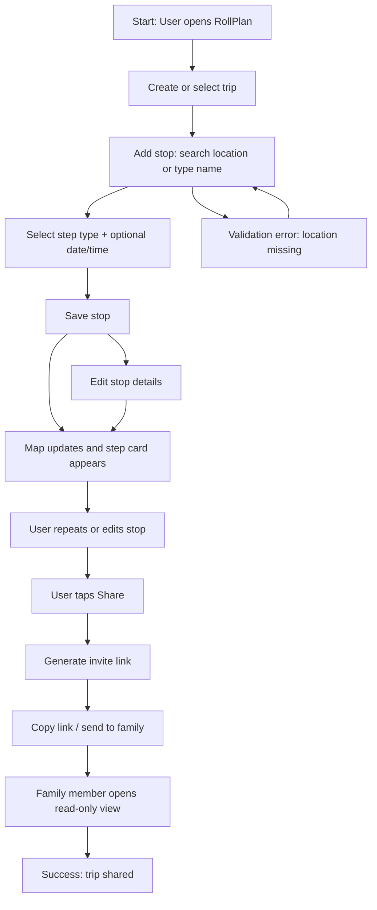
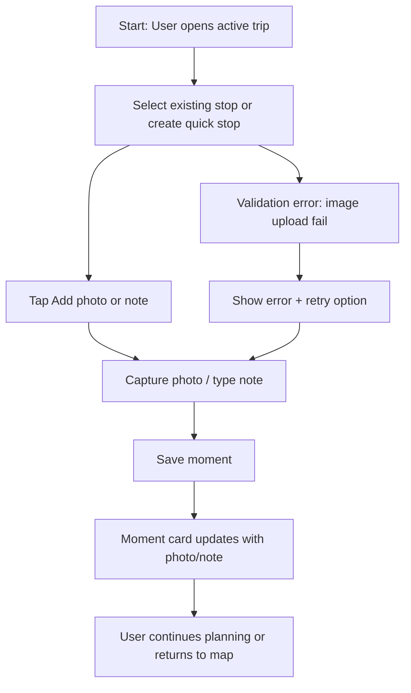

# UX Design Specification RollPlan

**Author:** Abdel
**Date:** 2026-04-05

---

<!-- UX design content will be appended sequentially through collaborative workflow steps -->

## Executive Summary

RollPlan is a family trip planning and memory app that brings planning, map visualization, and travel capture into one continuous experience. It helps a family trip organizer move from scattered notes and messages to a structured itinerary, while also making it easy to preserve moments during the trip.

### Project Vision

RollPlan combines itinerary creation with a map-first interface and Moment Cards for rich step detail. The product is designed to support both planning mode and capture mode, so users can plan the trip before departure and add photos, notes, and memories while traveling.

### Target Users

- Primary user: a family trip organizer (often a parent or designated planner) who wants to build, manage, and share a multi-stop family trip.
- Secondary users: family members and companions who view the trip through a shared invite link without needing an account.
- These users are looking for simplicity, clarity, and low friction — especially on mobile while on the go.

### Key Design Challenges

- Balancing rich trip detail with a streamlined planning flow.
- Making the map/list experience feel intuitive and useful, not overwhelming.
- Supporting a dual planning/capture workflow without confusing users.
- Enabling sharing via a public read-only link while keeping editing and privacy secure.
- Delivering a strong mobile-first experience for quick photo, note, and itinerary updates.

### Design Opportunities

- Use Moment Cards as the central product metaphor for each trip stop, blending logistics, notes, and photos.
- Create a guided trip creation flow with typed stops, autocomplete search, and clear defaults.
- Make the shared invite view feel polished and easy to consume on any device.
- Turn the map view into an “aha” moment by showing the whole trip at a glance.
- Reduce friction with inline validation, clear success feedback, and fast return-to-trip workflows.

## Core User Experience

### Defining Experience

RollPlan’s core experience is helping a family trip organizer move from scattered planning into one seamless map-centered itinerary. The primary action is building and refining trip stops, then enriching each stop with notes, photos, and logistics.

### Platform Strategy

RollPlan is a web-first single-page application targeting both desktop and mobile browsers. It should feel touch-friendly on phones while remaining efficient for mouse and keyboard users on larger screens. v1 focuses on online access with strong browser compatibility, without offline sync.

### Effortless Interactions

- Creating a step should feel fast and natural with typed categories, location autocomplete, and minimal required fields.
- Switching between map and list views should make the trip feel immediately understandable.
- Moment Cards should let users manage logistics, notes, and photos without jumping between screens.
- Generating and sharing a trip link should feel like a simple, one-click action.

### Critical Success Moments

- When a user sees the entire trip on the map and understands it instantly.
- When a user adds a stop and it appears correctly on the route with minimal effort.
- When a traveler captures a photo or note mid-trip without friction.
- When a family member opens a shared link and sees the trip clearly without signing in.

### Experience Principles

- Keep the planning flow simple, visual, and direct.
- Surface only the information needed for the current task.
- Make mobile capture fast: one hand, one action.
- Build confidence with clear feedback, validation, and recovery paths.

## UX Pattern Analysis & Inspiration

### Inspiring Products Analysis

The product goals and user profile align strongly with apps that make planning feel calm, visual, and collaborative. Products like Google Maps, Notion, and Airbnb offer useful inspiration:

- Google Maps demonstrates how a map-centered interface can make complex location data immediately understandable and trustworthy.
- Notion shows how clear, modular cards and inline editing can make rich content feel manageable without overwhelming the user.
- Airbnb proves that travel planning can be both aspirational and practical through strong visual hierarchy, simple filters, and clear progress.

For RollPlan, the key inspiration is combining the spatial clarity of a map with the modular, editable nature of Moment Cards.

### Transferable UX Patterns

- Map-first overview with a synchronized list: the map and trip step list should reflect each other instantly, so users understand the route and details at once.
- Card-based step editing: each trip stop should behave like a self-contained card, similar to Notion blocks, with expandable details, inline notes, and attached photos.
- Quick undo / confirmation patterns: like Google Maps' place pin interactions, the app should let users preview changes and recover easily from mistakes.
- One-click sharing: use a simple share sheet pattern where generating a link is a single action that returns immediate feedback and a copyable URL.

### Anti-Patterns to Avoid

- Overloading the map view with too much data at once: avoid cluttered pins, excessive labels, or too many controls that distract from the trip route.
- Forcing users into a rigid workflow: do not require exact step order or too many fields before a stop can be created; allow lightweight entry first, details later.
- Buried sharing settings: keep the invite link flow visible and easy, instead of hiding it behind deep menu navigation.
- Hard-to-edit Moment Cards: avoid modal-heavy experiences for step edits; inline or slide-over editing is preferable for quick updates.

### Design Inspiration Strategy

What to adopt:
- The clean map + list sync from Google Maps for clear trip overview.
- The modular card editing pattern from Notion for flexible step details.
- The simple sharing experience from Airbnb for an easy invite flow.

What to adapt:
- Use map pins as both navigation and storytelling elements, not just location markers.
- Apply the card metaphor to Moment Cards so notes, photos, and logistics live together naturally.
- Simplify the onboarding path so first-time trip creation is fast and reassuring.

What to avoid:
- Complex multi-step forms for step creation.
- Overly dense map dashboards that require explanation.
- Sharing flows that demand account access or too much configuration.

## Desired Emotional Response

### Primary Emotional Goals

RollPlan should make users feel confident, calm, and in control as they build and manage a family trip. It should also create a moment of delight when the trip’s route and memories come together in one place.

### Emotional Journey Mapping

- Discovery: Users should feel curious and relieved when they see a simple way to organize a family trip.
- Planning: Users should feel efficient and empowered while adding steps and shaping the itinerary.
- Capture: Users should feel satisfied and supported when they add photos or notes during the trip.
- Sharing: Users should feel proud and secure when they send a link that family members can view easily.
- Recovery: If something goes wrong, users should feel guided and reassured, not frustrated.

### Micro-Emotions

- Confidence over confusion when choosing locations, step types, or sharing links.
- Delight in seeing the trip on a map and in Moment Cards.
- Relief when the app protects against mistakes and saves progress clearly.
- Trust that the shared view is easy for family members and preserves the trip story.

### Design Implications

- Use clear progressive disclosure and step guidance so users always know what to do next.
- Make map feedback immediate and readable, reducing anxiety about trip structure.
- Provide reassuring confirmations for share links, saves, and deletions.
- Add subtle delight in micro-interactions, such as map pin reveals and photo upload previews.

### Emotional Design Principles

- Build trust with clarity, consistency, and forgiving interactions.
- Make the trip feel manageable and meaningful, not overwhelming.
- Create moments of delight through visual feedback and simple success cues.
- Keep the experience warm and human, reflecting the family memory focus of the product.

## Design System Foundation

### 1.1 Design System Choice

For RollPlan, a themeable system built on Tailwind CSS with custom Angular components is the best fit. This approach offers the speed and consistency of a proven utility-first system while allowing a warm, travel-inspired visual style that matches the product’s family memory focus.

### Rationale for Selection

- Speed: Tailwind CSS accelerates frontend development with reusable utility classes and strong defaults.
- Flexibility: The project can keep a distinctive look without rebuilding every component from scratch.
- Platform fit: Tailwind works well with Angular standalone components and responsive mobile-first layouts.
- Maintenance: The CSS utility approach keeps styles predictable and easier to evolve than a completely custom design system.

### Implementation Approach

- Use Tailwind CSS as the core design foundation for spacing, typography, colors, and responsive layout.
- Build a small set of reusable Angular components for cards, buttons, form controls, modals, and map controls.
- Keep component behavior consistent through shared abstractions and design tokens (colors, radii, shadows, spacing).
- Use a lightweight component library only for accessibility-ready primitives when needed, rather than a full UI framework.

### Customization Strategy

- Define brand tokens for a calm travel palette, soft shadows, and approachable spacing.
- Create a `ui/` component set for Moment Cards, trip item cards, map overlays, and share interactions.
- Use Tailwind theme extensions for color and spacing scales, then apply those in Angular templates.
- Reserve custom visuals for the map/list switcher, share CTA, and Moment Card interactions, while keeping form and list patterns simple.

## 2. Core User Experience

### 2.1 Defining Experience

The defining experience for RollPlan is creating and refining a trip stop from the map/list overview, then immediately seeing that stop become part of the journey. When users add or edit a stop, they should feel like they are building their trip, not filling out a form.

### 2.2 User Mental Model

Users think of the product as a travel board where each stop is a moment to plan or capture. They expect locations to be added quickly, mapped visually, and edited in place with clear, familiar controls.

### 2.3 Success Criteria

- Users can add a new trip stop in under 30 seconds with location, type, and timing.
- The route updates visibly and the new stop appears on the map and in the list immediately.
- Users feel confident when editing a stop because changes are reflected instantly and undo/revert options are available.
- Sharing a trip link is simple and clearly communicates that the view is read-only for recipients.

### 2.4 Novel UX Patterns

RollPlan blends established map/list patterns with a Moment Card metaphor that keeps planning and memory capture in one place. The core innovation is treating each stop as both itinerary item and memory container, which reduces context switching.

### 2.5 Experience Mechanics

1. Initiation:
   - User begins by creating a trip or selecting an existing trip.
   - The UI prompts with a clear primary action like “Add stop” or “Add moment.”

2. Interaction:
   - The user enters a stop name or searches a location using autocomplete.
   - They choose a step type and optionally add time/date, note, or photo.
   - The system immediately renders the stop as a card and map pin.

3. Feedback:
   - The map pin appears with a short animation and the step card expands in the list.
   - Inline validation and tooltips guide missing or invalid input.
   - A subtle confirmation indicates the stop was saved successfully.

4. Completion:
   - The user sees the updated route and the stop in the trip timeline.
   - The UI offers next actions like “Add another stop,” “View on map,” or “Share trip.”
   - Success feels tangible through visual continuity between the map, card, and trip summary.

## User Journey Flows

### Trip Planning & Sharing Journey

This journey covers the main flow from creating a new trip through adding stops and sharing it with family. The goal is to make planning feel effortless while reinforcing the map-based structure and the shareable memory story.

### On-the-Road Moment Capture Journey

This journey covers the capture-mode flow where a user adds notes or photos during the trip. It should feel fast, low-friction, and reassuring so users can document moments without interrupting their travel.

### Journey Patterns

- **Map/list synchronization:** Changes in the trip list immediately reflect on the map, and map selections reveal the corresponding stop card.
- **Modular step cards:** Each stop acts as a reusable Moment Card for planning, editing, and memory capture.
- **Progressive disclosure:** Users can start with minimal stop data and add details later.
- **Immediate feedback:** Save confirmations and map updates reinforce success after every interaction.
- **Share and view separation:** The sharing path is clearly distinct from edit mode, preventing confusion for recipients.

### Flow Optimization Principles

- Minimize steps to the first meaningful result: users should add a stop with the fewest required inputs and see it on the map immediately.
- Keep core actions visible: “Add stop,” “Edit,” and “Share” are always accessible without deep navigation.
- Use inline validation and clear error messaging to prevent users from getting stuck.
- Provide lightweight edit mode for moment capture so travelers can add photos and notes in one flow.
- Preserve context after actions: after saving, users should stay in the same view with obvious next actions.

## UX Consistency Patterns

### Button Hierarchy

- Primary actions should use the strong sea green button style with solid fill and white text.
- Secondary actions should use a border button with neutral text and a lighter background.
- Tertiary actions should be text-only links for low-risk actions like "Learn more" or "Help." 
- Buttons should use consistent spacing and size, with a minimum 44x44px tappable area on mobile.
- Destructive actions should use the warm sunset orange only when the action is irreversible.

### Feedback Patterns

- Success messages should appear as toasts or inline labels with a green accent and concise confirmation text.
- Errors should be shown inline for form fields with red text and an optional summary banner at the top.
- Warnings should use a yellow/orange accent and provide clear guidance on how to recover.
- Informational states should use neutral blue/gray tones and avoid competing with primary actions.
- All feedback messages should be dismissible and maintain context so users know what changed.

### Form Patterns

- Form fields should use grouped layouts with labels above inputs and helper text below when needed.
- Validation should occur on submit and on blur, with clear inline error text and accessible ARIA descriptions.
- Use consistent form spacing and field heights across all screens.
- Disable submit actions only when required fields are missing, and keep the button visible to show progress.
- Support quick entry by allowing optional fields to remain hidden until the user chooses to expand details.

### Navigation Patterns

- Primary navigation should be available at the top for desktop and in a bottom bar or slide-out panel on mobile.
- Use clear labels and icons for key sections like Trips, Map, Capture, and Share.
- Keep navigation shallow to reduce friction—users should reach core actions in 1-2 taps.
- Use breadcrumbs or contextual headers for secondary screens like trip details and step editing.

### Additional Patterns

- Modal and overlays should use the same card styling as Moment Cards, with a visible close button and a clear title.
- Loading states should use skeleton placeholders and subtle fade-in transitions to reduce perceived wait time.
- Empty states should provide guidance, a clear primary action, and a small visual treatment to keep the screen friendly.
- Search and filtering should appear prominently on trip and step lists, with quick reset actions and clear active filter chips.

### Design System Integration

- Patterns should map directly to Tailwind utility classes and the custom Angular component library.
- Use consistent component variants for buttons, cards, form controls, and overlays.
- Keep the UX patterns aligned with the existing color, typography, spacing, and interaction rules.
- Document a small set of core pattern rules for developers to follow when extending the interface.

### Accessibility Considerations

- Ensure all button and form controls have visible focus states and proper keyboard order.
- Feedback and validation should be announced to screen readers via ARIA live regions.
- Use clear contrast ratios for text, icons, and interactive elements.
- Provide alternative text for icons and imagery where needed, especially in empty states and guidance screens.

## Responsive Design & Accessibility

### Responsive Strategy

RollPlan should use a mobile-first responsive strategy that gracefully scales from phones to tablets and desktops. The interface should prioritize the most critical trip actions on small screens, while using expanded layouts and additional context on larger screens.

- Mobile: single-column layout with bottom or persistent quick actions, focused map preview, and easy access to add-stop controls.
- Tablet: two-column layouts where the map and trip card list can sit side-by-side, with touch-friendly spacing and foldable panels.
- Desktop: split-screen map/list view with more detailed side panels, a persistent top action bar, and content-rich route / trip summary areas.

### Breakpoint Strategy

Use standard responsive breakpoints tuned for the planned app experiences:
- Mobile: up to 767px
- Tablet: 768px to 1023px
- Desktop: 1024px and above

This mobile-first approach uses Tailwind’s responsive utilities and avoids heavy desktop-only behaviors at smaller widths.

### Accessibility Strategy

Aim for WCAG 2.1 Level AA compliance across the app.

- Maintain 4.5:1 contrast ratio for normal text and 3:1 for large text.
- Ensure all interactive controls are reachable via keyboard navigation.
- Provide meaningful focus indicators for buttons, links, cards, and form fields.
- Use semantic HTML plus ARIA roles/labels for maps, dialogs, and dynamic feedback regions.
- Ensure all images, icons, and action controls have accessible names and alt text.
- Keep touch targets at a minimum of 44x44px on mobile.

### Testing Strategy

- Responsive testing on representative device widths: phone, tablet, desktop.
- Browser testing across Chrome, Firefox, Safari, and Edge.
- Automated accessibility checks using tools like Axe or Lighthouse.
- Keyboard-only navigation testing for all flows.
- Screen reader validation with VoiceOver and NVDA where possible.
- Color blindness simulation testing for key UI states.

### Implementation Guidelines

- Use relative units (`rem`, `%`, `vw`) rather than fixed pixels.
- Implement mobile-first media queries for layout shifts.
- Keep maps and interactive controls responsive, with touch-friendly tap targets and pan/zoom support.
- Use semantic markup for all form fields and controls.
- Leverage Tailwind utility classes for responsive spacing and typography.
- Add `aria-live` regions for important status messages and feedback.

## Design Direction Decision

### Design Directions Explored

We explored multiple visual design directions that vary in layout density, card emphasis, map focus, and navigation style. The directions ranged from an airy, minimal travel planner with large map emphasis to a more structured itinerary dashboard that prioritizes step details and quick actions.

### Chosen Direction

The chosen direction is a warm, map-forward interface with modular Moment Cards. This approach balances the visual clarity of the map overview with the approachable interaction model of card-based stop details.

### Design Rationale

- The map-forward layout reinforces the travel planning nature of the product.
- Moment Cards create a clear content hierarchy while supporting both planning and capture modes.
- The warm color palette and soft spacing support the family-journey emotional tone.
- The chosen direction aligns well with mobile-first interactions and keeps core actions accessible.

### Implementation Approach

- Build the main trip screen around a split map/list layout with prominent primary actions.
- Use card surfaces for each stop and quick-access controls for editing, notes, and photos.
- Include a persistent top bar for trip actions, share controls, and current trip status.
- Use the Tailwind-based theme to apply the color palette, typography scale, and spacing system consistently across mockups.

## Visual Design Foundation

### Color System

RollPlan should use a calm travel-inspired palette with a warm primary blue-green, soft neutrals, and accent colors for actions and status.

- Primary: soft sea green for primary actions and highlights.
- Secondary: warm sandy beige for backgrounds and calm surfaces.
- Accent: sunset orange for call-to-action and positive moments.
- Neutral: charcoal and cool gray for text, borders, and subtle depth.

Semantic color mapping:
- Primary: buttons, links, active state
- Secondary: cards, surface backgrounds
- Success: success chips, confirmations
- Warning: caution labels and alerts
- Error: form errors and destructive actions
- Neutral: text, disabled states, borders

### Typography System

RollPlan should use a modern, friendly type system with strong readability for both desktop and mobile.

- Primary typeface: a clean sans-serif for UI and headings.
- Secondary typeface: a neutral sans-serif for body text and captions.
- Type scale:
  - h1: 32px / 40px
  - h2: 28px / 36px
  - h3: 24px / 32px
  - body: 16px / 24px
  - caption: 14px / 20px
- Line heights should be generous for mobile readability and compact enough for list-based interfaces.

## Component Strategy

### Design System Components

The chosen foundation is Tailwind CSS with custom Angular components. Tailwind provides utility-based building blocks for layout, spacing, typography, and color, while custom components handle domain-specific behaviors like Moment Cards and trip map interactions.

**Foundation components available from Tailwind CSS / Angular primitives:**
- Buttons, links, cards, badges, forms, inputs, modals, tooltips
- Responsive grid and spacing utilities
- Typography and color utilities
- Accessible form controls and focus states

### Custom Components

**Moment Card**
- Purpose: Display trip stop details, notes, photos, and quick actions.
- Usage: Main building block for itinerary items and memory capture.
- Anatomy: header, type chip, location line, photo preview, note excerpt, action buttons.
- States: default, hover, selected, editing, disabled.
- Variants: compact list card, expanded detail card, capture-focused card.
- Accessibility: keyboard focus, ARIA labels for action buttons, clear visual focus ring.

**Trip Map Panel**
- Purpose: Show the trip route and location pins with quick stop selection.
- Usage: Primary map/list screen and share preview.
- Anatomy: map canvas, pin overlay, mini legend, map controls.
- States: default, pin hover, selected stop, map loading, no data.
- Variants: full-width map, split-screen map, compact summary map.
- Accessibility: keyboard navigation support for map controls where possible, visible labels.

**Share Link Panel**
- Purpose: Create and copy shareable trip links with status feedback.
- Usage: Trip action bar and trip settings.
- Anatomy: link text, copy button, revoke action, status message.
- States: ready, copied, error.
- Variants: inline panel, modal.
- Accessibility: keyboard focus, status announcements on copy.

**Step Type Selector**
- Purpose: Choose a stop category quickly (Travel, Accommodation, Activity, Meal, Rest).
- Usage: Stop creation/edit form.
- Anatomy: segmented controls or pill buttons, helper text.
- States: selected, disabled, error.
- Variants: horizontal pill selector, dropdown for compact mode.
- Accessibility: ARIA role="radiogroup", keyboard arrow navigation.

**Photo Capture & Preview**
- Purpose: Capture and review step photos in the trip flow.
- Usage: Moment Card detail and capture mode.
- Anatomy: camera action button, thumbnail row, upload progress, remove action.
- States: empty, uploading, uploaded, upload error.
- Variants: inline preview strip, full-screen preview.
- Accessibility: alt text for preview images, keyboard remove action.

### Component Implementation Strategy

- Use Tailwind utility classes for layout, spacing, color, and typography.
- Build custom components as Angular standalone components with clearly typed inputs and outputs.
- Keep component APIs small and reusable across travel planner flows.
- Ensure visual consistency using shared Tailwind theme tokens for colors, radii, shadows, and spacing.
- Use Angular templates for markup structure and Tailwind classes for styling.
- Add accessibility support by default in every component, including keyboard focus, ARIA labels, and meaningful semantic HTML.

### Implementation Roadmap

**Phase 1 - Core Components**
- Moment Card: critical for trip planning and capture.
- Trip Map Panel: central to the defining experience.
- Step Type Selector: key for quick stop creation.
- Share Link Panel: essential for the sharing journey.

**Phase 2 - Supporting Components**
- Photo Capture & Preview: supports on-the-road memory capture.
- Form Controls & Validation: consistent field behaviors across trip and profile forms.
- Top Bar / Action Bar: persistent trip actions and navigation.

**Phase 3 - Enhancement Components**
- Notification Toasts: subtle success and error feedback.
- Empty State Cards: help users when no trips or stops exist.
- Tour/Onboarding Banner: guide first-time users through initial trip creation.

### Spacing & Layout Foundation

The layout should feel airy but efficient, using an 8px spacing system.

- Base spacing unit: 8px.
- Small gap: 8px.
- Regular gap: 16px.
- Large gap: 24px.
- Extra-large gap: 32px.

Layout principles:
- Keep interfaces open and uncluttered, especially around map/list views.
- Use generous card padding and whitespace to reduce visual noise.
- Align content using a 12-column responsive grid for desktop and a single-column flow on mobile.
- Prioritize balanced space around interactive elements so touch targets feel easy.

### Accessibility Considerations

- Ensure contrast ratios meet WCAG AA for text and interactive elements.
- Use a minimum tappable target size of 44x44px for mobile actions.
- Make form labels and field states clear, with error text and focus outlines.
- Use semantic HTML and ARIA where necessary for map controls, modals, and dialogs.

